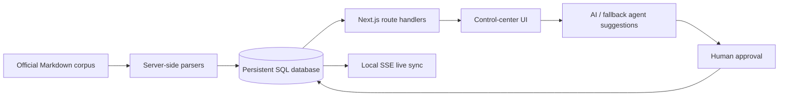

# FlytLoop

FlytLoop is an AI-native customer-product feedback operating system for the FlytBase GTM Hackathon Solutions Engineer track.

## Architecture



The current local adapter is SQLite (`data/flytloop.db`) using parameterized statements. It is accessed only through the service layer so a PostgreSQL/Supabase adapter can replace it when credentials are supplied. The original browser prototype is preserved in [`legacy-static/`](legacy-static/).

## Run

```bash
npm install
cp .env.example .env.local # optional: add OPENAI_API_KEY
npm run import
npm run dev
```

Open `http://localhost:3000`.

## Key capabilities

- Server-only, idempotent Markdown import with checksum audit trail and source provenance.
- Persistent accounts, source records, feedback, lifecycle history, customer validation, feedback, notifications, and activity logs.
- Canonical feature requests and deterministic exact-title issue clustering; individual `ISS-XXXX` records are retained.
- API-backed Feedback Inbox with human-approved triage and duplicate intelligence.
- Lifecycle pipeline, Account 360, Signals, Agent Center, controlled-data Copilot, Dataset Audit, and team workspaces.
- Shipped → validation → customer feedback → optional linked request loop, with Product and Engineering notifications.
- SSE-backed local sync indicator: every client refreshes database state from the API on an active server heartbeat.

## AI configuration

`OPENAI_API_KEY` and `OPENAI_MODEL` are optional and remain server-side. If absent, the UI truthfully shows **Fallback mode** and runs deterministic classification. Both paths return a validated structured suggestion; no AI result writes data without user approval.

## Limitations

- No Supabase/PostgreSQL credentials were supplied, so this local demo uses a persistent SQLite database. The repository includes no deployed multi-instance realtime provider.
- Lightweight demo identities are display-only; Supabase Auth/RBAC activates only when supplied and integrated in a deployment.
- Customer Context and closure analysis are fact-grounded deterministic briefs in fallback mode. OpenAI triage becomes active with a key.
- All source data is official synthetic hackathon data; no FlytBase production system is connected.
