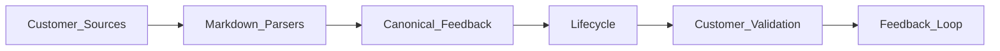

# FlytLoop

FlytLoop is a dependency-free, locally runnable Product Feedback Lifecycle Tracker for the FlytBase GTM Hackathon Solutions Engineer track.

## Run

```bash
npm run dev
```

Open `http://localhost:5174`. It reads the supplied corpus directly from `se-dataset (1)/`: accounts, feature requests, issues, meeting notes and tasks.

## What it demonstrates

- Exact source parsing with account-name resolution and source provenance.
- Canonical feature requests and deterministic exact-title issue clustering while preserving each `ISS-XXXX` source record.
- Customer Account 360, Command Center, team views, Signals, Dataset Audit, and lifecycle pipeline.
- Human-approved fallback triage into `FEATURE_REQUEST`, `BUG`, or `SUPPORT`, including duplicate suggestions.
- Shipped request → customer validation → linked product request, visibly routed to Product and Engineering.

## Architecture



## Limits

The official corpus is synthetic. The impact score is a prototype prioritization model; similarity and fallback triage are suggestions and require human confirmation. This prototype has no production integration, authentication, email notifications, or real customer data.
